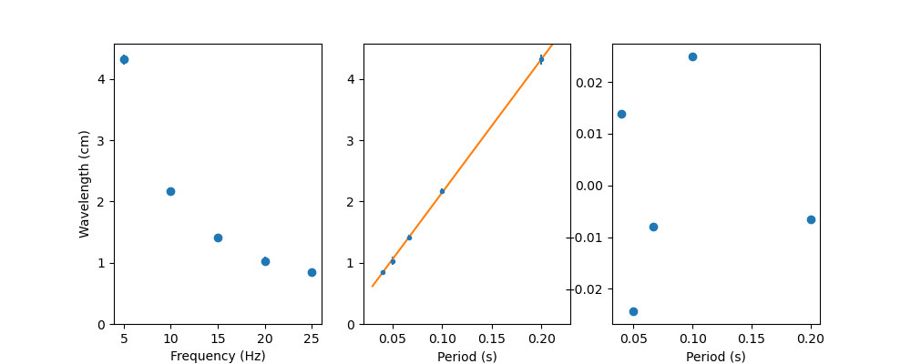

This repository contains scripts I wrote
to generate graphs for one of my second year physics lab (PHY294).
Graphs are shown below (without their captions) although they don't mean much without context.

